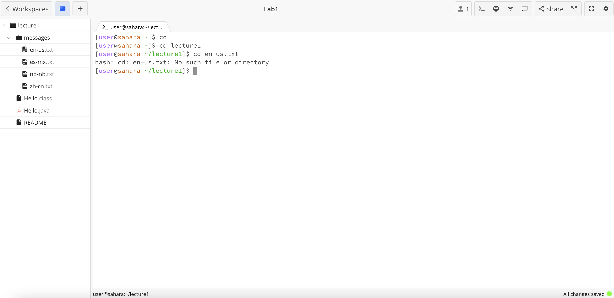

# Lab Report 1

> cd
No arguments:
---

The working directory when the command was passed was /home. The output was nothing because we were already in the "outermost" directory so we could not go "up" another directory. The output is not an error.

Directory as argument:
---
The working directory when the command was passed was /home. The output was nothing but our working directory changed to the lecture1 directory because this is what we passed an an argument. The output is not an error.

File as arguement:
---
The working directory when the command was passed was /home/lecture1. The output was an error message that said "bash: cd: en-us.txt: Not a directory" because we were trying to change the directory to a file and this is not possible because the file is not a directory.

## ls
No arguments:
---
The working directory when the command was passed was /home/lecture1. The output was "Hello.class  Hello.java  messages  README" which is the list of all the files and directories contained in the lecture1 directory because this is the working directory when we passed the command. The output is not an error.

Directory as argument:
---
The working directory when the command was passed was /home/lecture1. The output was "en-us.txt  es-mx.txt  no-nb.txt  zh-cn.txt" which is the list of all the names of the text files stored within the messages directory which we passed as an arguement. The output is not an error.

File as arguement:
---
The working directory when the command was passed was /home/lecture1/messages/. The output was "en-us.txt" because this is the only file that is stored under the directory of en-us.txt which we passed as an argument. The output is not an error.

## cat
*No arguments: *
The working directory when the command was passed was 
*Directory as argument: *

*File as argument: *
