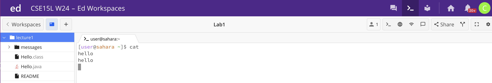

# Lab Report 1

## cd
> No arguments:
---

The working directory when the command was passed was /home. The output was nothing because cd with no arguments changes the directory to the "outermost" directory but we were already in the "outermost" or home directory. The output is not an error.

> Directory as argument:
---

The working directory when the command was passed was /home. The output was nothing but our working directory changed to the lecture1 directory because this is what we passed an an argument. The output is not an error.

> File as arguement:
---

The working directory when the command was passed was /home/lecture1. The output was an error message that said "bash: cd: en-us.txt: Not a directory" because we were trying to change the directory to a file and this is not possible because the file is not a directory.

## ls
> No arguments:
---

The working directory when the command was passed was /home. The output was "lecture1" which is the only item contained in the /home directory because this is the working directory when we passed the command. The output is not an error.

> Directory as argument:
---

The working directory when the command was passed was /home. The output was "Hello.class  Hello.java  messages  README" which is the list of all the names of the items stored within the lecture1 directory which we passed as an argument. The output is not an error.

> File as arguement:
---

The working directory when the command was passed was /home. The output was "Hello.java" because this file is stored in the current working directory and the ls command checks if the file is in the current working directory and it is. The output is not an error.

## cat
> No arguments:
---

The working directory when the cat command was passed was /home. There was no output because there was no file specified to read from and no error but instead the terminal took standard input from the keyboard. I typed in "Hello" and "Hello" was printed out. 

> Directory as argument:
---

The working directory when the cat command was passed was /lecture1. The output was an error message stating "cat: messages: Is a directory" because we passed a directory as an argument and the cat command cannot read the content stored in a directory.

> File as argument:
---

The working directory when the cat command was passed was /lecture1/messages. The output was
```
Hello World!
¡Hola Mundo!
```
because these are the contents of the files passed as arguments. The output is not an error.
