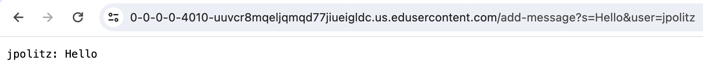
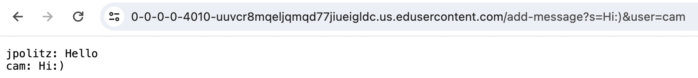
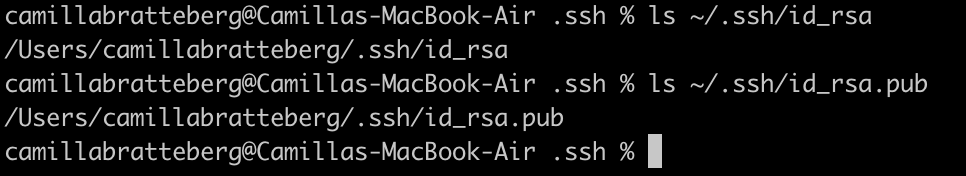
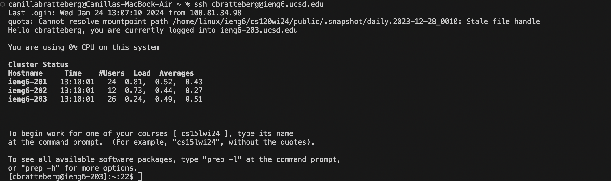

# Part 1
`ChatServer.java`
```
import java.io.IOException;
import java.net.URI;

class Handler implements URLHandler {

    String str = "";

    public String handleRequest(URI url) {
        if (url.getPath().equals("/")) {
            return String.format(str);
        } 
        else {
            if (url.getPath().contains("/add-message")) {
                String[] parameters = url.getQuery().split("=");
                if (parameters[0].equals("s")) {
                    String[] para1 = parameters[1].split("&");
                    str += parameters[2] + ": " + para1[0] + "\n";
                    return String.format(str);
                }
            }
            return "404 Not Found!";
        }
    }
}

class ChatServer {
    public static void main(String[] args) throws IOException {
        if(args.length == 0){
            System.out.println("Missing port number! Try any number between 1024 to 49151");
            return;
        }

        int port = Integer.parseInt(args[0]);

        Server.start(port, new Handler());
    }
}
```

`Server.java`
```
import java.io.IOException;
import java.io.OutputStream;
import java.net.InetSocketAddress;
import java.net.URI;

import com.sun.net.httpserver.HttpExchange;
import com.sun.net.httpserver.HttpHandler;
import com.sun.net.httpserver.HttpServer;

interface URLHandler {
    String handleRequest(URI url);
}

class ServerHttpHandler implements HttpHandler {
    URLHandler handler;
    ServerHttpHandler(URLHandler handler) {
      this.handler = handler;
    }
    public void handle(final HttpExchange exchange) throws IOException {
        try {
            String ret = handler.handleRequest(exchange.getRequestURI());
            // form the return string and write it on the browser
            exchange.sendResponseHeaders(200, ret.getBytes().length);
            OutputStream os = exchange.getResponseBody();
            os.write(ret.getBytes());
            os.close();
        } catch(Exception e) {
            String response = e.toString();
            exchange.sendResponseHeaders(500, response.getBytes().length);
            OutputStream os = exchange.getResponseBody();
            os.write(response.getBytes());
            os.close();
        }
    }
}

public class Server {
    public static void start(int port, URLHandler handler) throws IOException {
        HttpServer server = HttpServer.create(new InetSocketAddress(port), 0);

        server.createContext("/", new ServerHttpHandler(handler));

        server.start();
        System.out.println("Server Started!");
    }
}
```

For both `/add-message` examples pictured below, the main method in `ChatServer.java` is called with the argument of a port number of 4010 for the server. The main method calls the `start` method in `Server.java` which has the arguments of a port number of type int and a handler of type URLHandler. The port number is the argument from the main method and the handler is a new object of type Handler. The `start` method starts a new server with the given port number and handler. When the user executes the `/add-message' command, the `handleRequest` method is called with the user's url of type URI as an argument. 


In the above example, the `str` field is updated to `"Jpolitz: Hello" + "\n"` when it used to be `""` because it updated according to the information in the url.

In the above example, the `str` field is updated to `"Jpolitz: Hello" + "\n" + "cam: hi:)" + "\n"` when it used to be `Jpolitz: Hello" + "\n"` because it updated according to the information in the url.

# Part 2


The second line in the screenshot above contains the absolute path for the private key and the fourth line contains the absolute path for the public key. 



# Part 3

Most of the concepts we learned in lab the past two weeks were completely new to me. Some things that stood out to me that I found helpful was being able to use the `ssh` command to connect to a remote server such as our CSE15L account. I also thought that being able to build and run our own web servers using `Server.java` and `NumberServer.java` as templates was a useful skill to have. 
