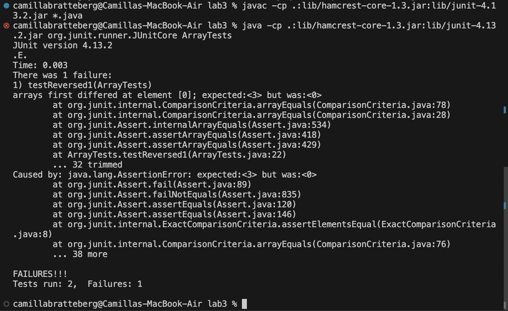

# Part 1
## Failure-inducing Input
```
@Test
 public void testReversed1() {
   int[] input = {1, 2, 3};
   assertArrayEquals(new int[]{3, 2, 1}, ArrayExamples.reversed(input));
}
```
## Input that doesn't induce failure
```
@Test
 public void testReversed2() {
   int[] input = { };
   assertArrayEquals(new int[]{ }, ArrayExamples.reversed(input));
}
```
## The Symptom

## The Bug: Before Code
```
  static int[] reversed(int[] arr) {
    int[] newArray = new int[arr.length];
    for(int i = 0; i < arr.length; i += 1) {
      arr[i] = newArray[arr.length - i - 1];
    }
    return arr;
}
```
## The Bug: After Code
```
  static int[] reversed(int[] arr) {
    int[] newArray = new int[arr.length];
    for(int i = 0; i < arr.length; i += 1) {
      newArray[arr.length - i - 1] = arr[i];
    }
    return newArray;
  }
```
The code fix of swapping the assingment from `arr[i]` to `newArray[arr.length - i - 1]` to `newArray[arr.length - i - 1]` to `arr[i]` addresses the issue because before the code was assigning the values of the original array to the values of the newArray which was all the intial value of 0 and then returning the original array. This did not give the expected output because instead of reversing the array, it set all of the array values to 0. The fixed code instead assigns the appropriate index of the new array to the index of the original array, changing the values of the new array to the reversed values of the original array and then returns the new reversed array which is the desired outcome.
# Part 2
