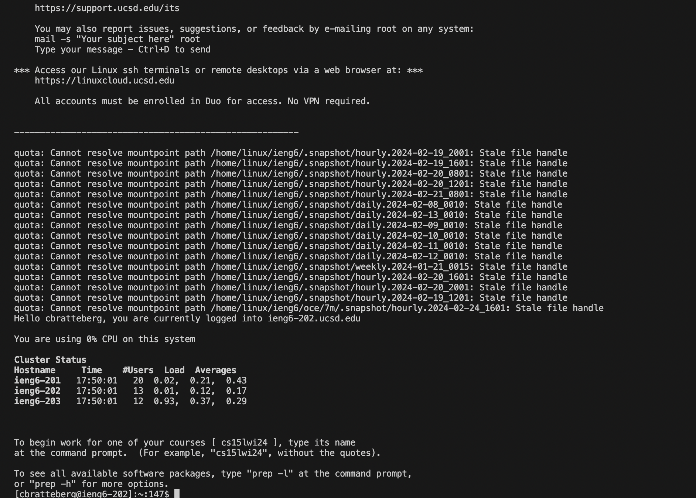
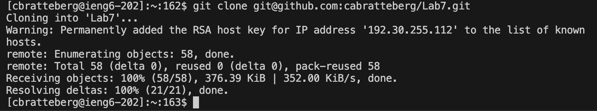
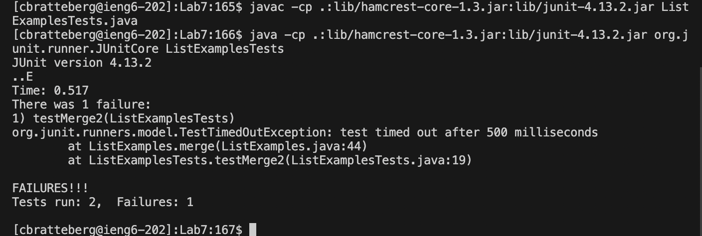
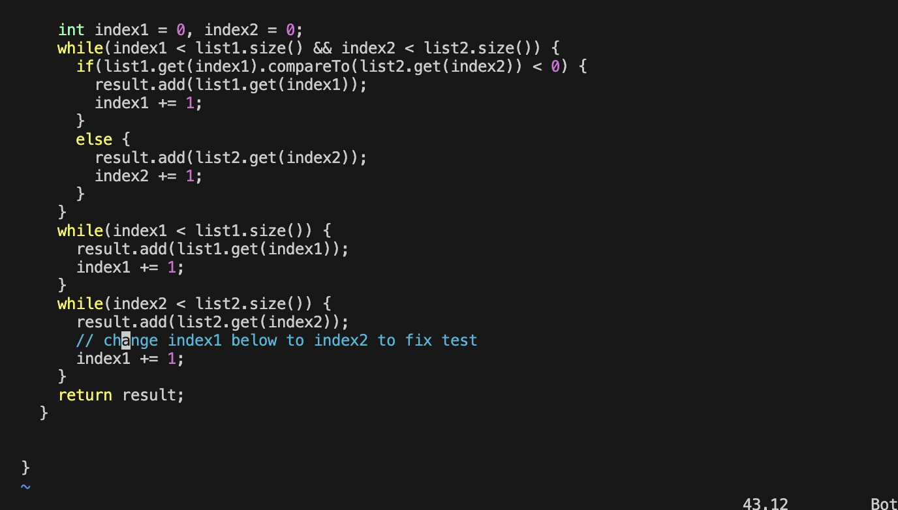
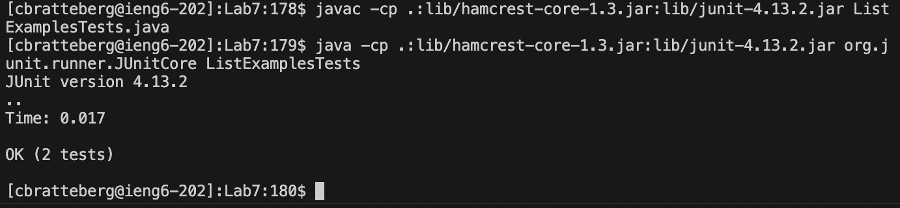
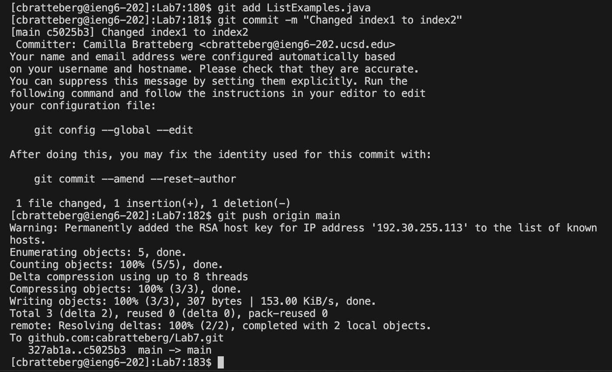

## Step 4

I typed in `ssh cbratteberg@ieng6.ucsd.edu` `<enter>` which logged me into the ieng6 server.

## Step 5

In my repository I used `<Cmd>` + `<C>` to copy the ssh link which is `git@github.com:cabratteberg/Lab7.git`. Then I typed in `git clone ``<Cmd>` + `<V>` `<enter>` which cloned the repository into my ssh account.

## Step 6

I typed in `cd Lab7` `<Enter>` to change my directory to the Lab7 directory containing the needed files. Then, after I `<Cmd>` + `<C>` from the Week 4 module in the course website, I `<Cmd>` + `<V>` which pasted `javac -cp .:lib/hamcrest-core-1.3.jar:lib/junit-4.13.2.jar` into my terminal. Then I typed in `<Space>` `ListExamplesTests.java` `<enter>` which compiled the JUnit tests in the ListExamplesTests.java file. 

Then, after I `<Cmd>` + `<C>` from the Week 4 module in the course website, I `<Cmd>` + `<V>` which pasted `java -cp .:lib/hamcrest-core-1.3.jar:lib/junit-4.13.2.jar org.junit.runner.JUnitCore` into my terminal. Then I typed in `<Space>` `ListExamplesTests` `<enter>` which ran these tests. 

## Step 7

I pressed `<j>` 43 times to move down to the line with the error, then `<l>` 11 times to move over to the character with the error (the 1 in index1), then `<x>` to delete the character
causing the error, then `<i>` to go into vim insert mode, then `<2>` to insert a 2 where there used to be a 1 changing from index1 to index2 and fixing the error,
then `<ctrl> + <c>` to get out of insert mode, then `:wq` save changes made and exit vim mode.

## Step 8

Keys pressed: `<up>``<up>``<up>``<enter>` because the `javac ... ` command was 3 up in the search history so I used the up arrows to access it. Then `<up>``<up>``<up>``<enter>`
because the `java ... ` command was now 3 up in the search history so I used the up arrows to access it. After executing these two commands, the JUnit tests ran successfully with no failures. 

## Step 9

I typed `git add ListExamples.java``<enter>` which adds the file with changes in it to be committed, then I typed `git commit -m "Changed index1 to index2"``<enter>` to commit the changes made to the file and adds a message I input describing the nature of the changes,  then I typed `git push origin main``<enter>` to push the changes to my branched repository on GitHub.
