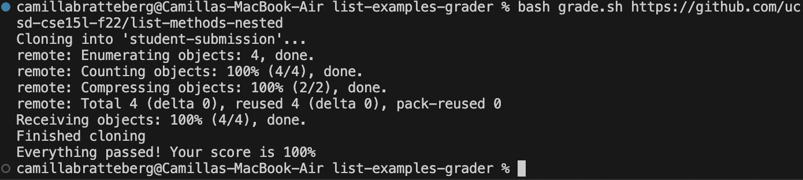

# Part 1
## Student Post:

Hi, I am struggling with a bug in my grading script because whenever I run the `bash grade.sh https://github.com/ucsd-cse15l-f22/list-methods-nested` command, I get unexpected output. I would expect the student to get a full score but instead I am getting output saying that their `ListExamples.java` file was not found.
My list-examples-grader contains four different files: `GradeServer.java` `Server.java` `TestListExamples.java` `grade.sh`.
I think there is an issue with my `grade.sh` file in the part of the code where it copies the student's `*.java` file into the `grading-area`. However, I am not sure how to fix this bug. 
Please help. I have attatched my code for my `grade.sh` file and a screenshot of the symptom of the bug.

`grade.sh`
```
CPATH='.:lib/hamcrest-core-1.3.jar:lib/junit-4.13.2.jar'

rm -rf student-submission
rm -rf grading-area

mkdir grading-area

git clone $1 student-submission
echo 'Finished cloning'

cp student-submission/*.java grading-area
cp TestListExamples.java grading-area 
cp -r lib grading-area

cd grading-area


if ! [ -f ListExamples.java ]
then 
    echo "Missing ListExamples.java in student submission"
    echo "Score: 0"
    exit
fi

javac -cp $CPATH *.java &> compile.txt 
if [ $? -ne 0 ]
then
    echo "Compilation Error"
    echo "Score: 0"
    exit
fi

java -cp $CPATH org.junit.runner.JUnitCore TestListExamples > outputResults 2>&1

SUCCESS=$(grep "OK" outputResults)

if [[ -n $SUCCESS ]]
then 
    echo "Everything passed! Your score is 100%"
else
    totalTests=$(grep -oE "Tests run: [0-9]+" outputResults | grep -oE "[0-9]+")
    Failures=$(grep -oE "Failures: [0-9]+" outputResults | grep -oE "[0-9]+")
    Success=$((totalTests - Failures))
    Percentage=$(echo "scale=2; $Success * 100 / $totalTests" | bc)
    echo "Score: $Percentage%"
fi
```

## TA Response:

Are there any special ways you could use the `find` command we learned about in class to fix your bug in the line where you are creating a copy of the student's file?

## Student Response:

Thank you! I was able to fix the bug. The issue was that my original code in line 11 was only looking in the `student-submission` directory for the file but once I changed that line to 
`find student-submission -name "ListExamples.java" -exec cp {} grading-area \;` the bug was fixed because now the program was able to copy the file regardless of which directory it was in
due to the use of the `find` command. I have attatched a screenshot of my results now after using your feedback!


# Part 2
One interesting thing I learned in the second half of this quarter was how to use vim. I think this is a very useful tool if you are not able to open a file in another application such as VSCode but still need to make changes or view the content of the file. It is very simple and easy to use and I found it very helpful. I had no idea you could do so much from the command line!
